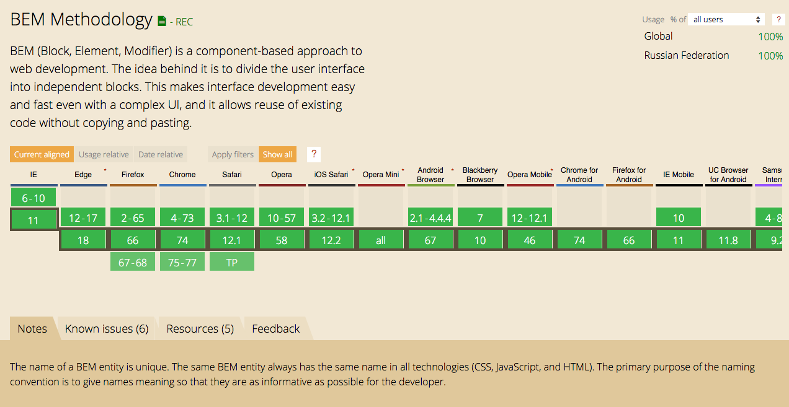

Вы не знаете БЭМ, или Почему БЭМ — пережиток прошлого
===============================================================================

> Цель доклада — не попытка розжига межпарадигмальной розни. Все совпадения с реальными событиями или личностями — правда.

> Для любителей заговоров — в докладе присутсвуют приёмы НЛП, увеличивающие конверсию и продажу.

Обо мне
-------------------------------------------------------------------------------

- рефакторю легаси-код в NevaTrip («авиасеилс» для локального туризма — экскурсии, мероприятия);
- самозванный БЭМ-евангелист, отвечаю на вопросы страждущих в [https://t.me/bem_ru](tg://resolve?domain=bem_ru), [офф. форуме](https://ru.bem.info/forum/) и на [Тостере](https://toster.ru/tag/bem/questions);
- самоучка с «синдромом самозванца»;
- дважды «выгорал» на проектах;
- есть Твиттер [@Realetive](https://twitter.com/Realetive)…

Попыток «рассказать о БЭМ» было много (но этого оказалось мало). Я хочу ещё раз попробовать объяснить мой путь и моё понимание.

### Материалы

- «Пишем БЭМ правильно» — Игорь Зенич https://youtu.be/hTmxbJF2Tts, http://ihorzenich.github.io/talks/bem-frontendweekend/
- «CSS-методологии от О до Б» — Алексей Охрименко https://youtu.be/1VM-vEItVeA
- «В поисках Стилевого Грааля» — Артур Кенжаев https://youtu.be/b7vBKp8D0vs

Больше никаких вопросов: «Правильно ли это по БЭМ?»

Вы сами должны разобраться в этом, я лишь покажу несколько неочевидных нюансов
Оспорьте мои утверждения. вы должны научиться, потому что без БЭМ-стека методология — это не подход, это мышление.

<!-- Кровавая свадьба -->

### Говорят, что БЭМ — религия.

> БЭМ — не религия!
> — © апостол Володимир Гриненко, «Житие св. Виталия Харисова и св. Сергия Бережного», глава 12, стих 34:12.

Я не сотрудник Яндекса и никогда им не был, но я — практикующий БЭМ-стек-разработчик и у меня есть несколько целей:


Цель доклада
-------------------------------------------------------------------------------

### Личные

- «достучаться» до мейнтейнеров БЭМ-методологии (документация непонятна новичкам);
- предупредить распространение неверного понимания методологии менторами и наставниками;
- повысить качество кросскомандного кода (един(ственн)ая методология) — с ним и мне может придтись работать.

### Не о …

- не о именовании CSS-классов («много чёрточек», «срань из классов в каждом теге»);
- не о инкапсуляции стилей;
— не осуждение других подходов (Atomic Design, SMACSS, OCSS, CSS-in-JS, CSS Modules);
- не *продажа* «серебряной пули»;

### Features

- об одной из 2 проблем программирования (именовании);
- о использовании CSS-модулей и CSS-in-JS;
- о организации файлов и структуры проекта;

Поддержка браузерами
-------------------------------------------------------------------------------




Проблема БЭМ
-------------------------------------------------------------------------------


> — Почему БЭМ так слабо «отвечает» современным требованиям веб-разработки?

— Потому что на вопросы отвечают те, кто мыслит в абсолютно другой плоскости и другими понятиями.

БЭМ - такой же подход, как и ООП или ФП, только на другом уровне — Файловой Системе. БЭМ — это паттерн проектирования более высокого уровня (как «Абстрактная фабрика», которая состоит из «Фабричных методов»).

> — Хьюстон, у нас проблема.

Нам подарили технологию (абсолютное знание), но не объяснили, как достичь просветления. Представьте, если бы нам дали Реакт, но из всего материала — только оффициальная документация с материалами первых 2-х лет, описывающих основную концепцию (без туториалов, учебников, обучающих уроков на Youtube, статей на Medium, лекций, докладов и Дэна Абрамова). Подобная история, кажется, творится в мире EmberJS — у них всё было хорошо до Vue.js.


### Словарь

> У блока не должно быть «внешней» геометрии

— Внешние отступы и позиционирование навязаны внешним блоком (элементами), самому блоку «знать» об этом ни к чему (Абсолютно Независимый Блок).

> Блок — самостоятельная сущность, элемент может существовать только внутри блока

— Зависимые компоненты (элементы) не «болтаются» по всей Файловой системе, а лежат внутри блока. Логика разных сущностей изолирована друг от друга.

Вроде как и объяснил, но всё равно понятнее не стало (зачем? как?), да?


Ча.Во (Тостер, канал, форум)
-------------------------------------------------------------------------------

1. Правильно ли это по БЭМ?
2. Как стилизовать __такой__ блок?
3. Как давать классы, если большая вложенность?
4. Какие есть примеры БЭМ-вёрстки?..

Зачем БЭМ
-------------------------------------------------------------------------------

Что делает:
- правильно организовать структуру React/Angular/Vue/Svelte/mol/laravel/elm/yii/<здесь могла быть реклама вашего любимого _компонентного_ фреймворка>-компонентов — вынести элемент в отдельный файл для быстрого доступа и правильного реиспользования;
- иметь быстрый доступ к логической сущности в `$EDITOR` по `<Ctrl> + P`. CSS-in-JS в таком случае — лишь вопрос субъективного удобства (Developer eXperience);
- обеспечить быстрое понимание структуры вёрстки для нового участника (противоположная задача — «запретить» другим разработчикам повторять хорошие примеры из `production`-кода);
- …

> «зачем БЭМ», если изоляция решена CSS-in-JS, а на остальное пофиг?
— Зачем ДВС, если есть Убер?
- Смысл появления CSS-in-JS вполне закономерен. Раньше документацию писали в отдельном файле, позже появлились формат документирующих комментариев (JSDoc) и это показалось удобным и логичным. Возможно, кто-то придумает способ описания тестов в одном файле с функцией/методом/сущностью — и это тоже будет удобно. Но это не отменяет самой необходимости писать документацию или тесты. Так же и здесь — CSS-in-JS не отменяет БЭМ. А CSS-modules не замена БЭМ, т. к. под кажущейся простотой инкапсуляции мы «упрощаем» понимание кода (а саму проблему инкапсуляции одинаковых именований сущностей между разными проектами решается на БЭМ ещё проще).
Да, CSS-in-JS «подарил» нам более декларативный подход к написанию стилей в наших Реактах (не более того), но в БЭМ это уже было (года с 2006, и он ещё более декларативный).

— Смысл появления CSS-in-JS (styled-components, CSS-modules, etc.) тоже вполне понятен — нам дали классную технологию реализации компонентного подхода, но не объяснили, как разные технологии могут «храниться» в одном компоненте.

### БЭМ-подорожник:

- как разбить сущности на компоненты;
- как уменьшить дублирование кода (DRY) → больше смысла, но меньше кода;
- как дизайнеру, верстальщику и JS-разработчику единообразно описать состояния компонентов;

Как?
-------------------------------------------------------------------------------

### Использование модификаторов вида «ключ-значение»

«Благодаря» Гари Робертсу мы не знаем о возможности (и необходимости) группировки модификаторов.


Это как если бы все руководства по HTML/CSS были бы только на эльфийском языке и появился бы энтузиаст, который перевёл их все на русский, но «забыл» упомянуть про атрибут `class`, и что его можно использовать как селектор в CSS.

<!-- Арья ослепла -->

#### Почему?

##### «Ключ-значение» (композиция)

```yaml
button
  _type
    _link
    _submit/button
  _view
    _primary
    _secondary
    _warning
    _info
    _action
    _pseudo
  _submit
    _error
    _loading
    _success
  _size
    _e(xtra-)s(mall)
    _sm(all)
    _m(edium)
    _l(arge)
    _xl
    _xxl
  _theme
    _light
    _dark
  _width
    _available
    _shrink
  _hovered*
    _true
    _false
  _pressed*
    _true
    _false
  _focused*
    _true
    _false
```

##### Булевы модификаторы (комбинация)

```yaml
button
  --action
  --block
  --dark
  --error
  --focused
  --hovered
  --info
  --large
  --light
  --link
  --loading
  --medium
  --pressed
  --primary
  --pseudo
  --secondary
  --shrink
  --small
  --submit/button
  --success
  --warning
```

<!-- выход в окно -->

NB! `js-`/`l(ayout)-`/`c(omponent)-`префиксы не нужны `¯\_(ツ)_/¯`

#### «Ниасилил»

- ABEM. A more useful adaptation of BEM от Daniel Tonon на CSS-TRICKS: https://css-tricks.com/abem-useful-adaptation-bem
- Battling BEM CSS: 10 Common Problems And How To Avoid Them от David Berner на Smashing Magazine https://www.smashingmagazine.com/2016/06/battling-bem-extended-edition-common-problems-and-how-to-avoid-them/
- Fifty Shades of BEM от Kaelig в личном блоге https://blog.kaelig.fr/post/48196348743/fifty-shades-of-bem


### DDD - Data driven development (BEMJSON)

<!-- бой вслепую -->

1. Представить интерфейс как *структуру* __данных__;
2. Дать осмысленные имена (блоки, элементы);
3. Описать состояния (модификаторы).
4. Перенести эту структуру в вёрстку.
5. ???
6. PROFIT!!!


Пример
-------------------------------------------------------------------------------

### Организация формы

У формы (блок) есть поля (элементы), но у них (input, select, checkbox/switcher, radio) разное API. 

```yaml
# Структура формы

form:
- header
- field
- field:
  - focus
  - required
- [field, field, …]
- field:
  - validate: Error message
- reset
- submit:
  - disabled
```

<!-- Уход в Астрал -->

```yaml
# Как видит интерфейс БЭМ-разработчик

block: form
content:
  - elem: header
  - elem: field
  - elem: field
    mods:
      - focus: true
      - required: true
  - [field, field, …]
  - elem: field
    mods:
      - validate: Error message
  - elem: reset
  - elem: submit
    mods:
      - disabled: true
```

По умолчанию БЭМ-сущности описываются с помощью JSON — BEMJSON:

```js
{
  block: "form",
  content: [
    { elem: "header" },
    { elem: "field" },
    {
      elem: "field",
      mods: [ { focus: true },
              { required: true } ]
    },
    // [ "field", "field", "…" ],
    {
      elem: "field",
      mods: [ { validate: "Error message" } ]
    },
    { elem: "reset" },
    {
      elem: "submit",
      mods: [ { disabled: true } ]
    }
  ]
}
```

Добавляем позиционирование («элементы» ___можно___ вкладывать друг в друга):

```diff
  {
    block: "form",
    content: [
      {
        elem: "header",
+       content: {
+         elem: 'title',
+         content: { block: 'heading', content: 'Форма' }
+       }
      },
+     {
+       elem: 'body',
+       content: [
          { elem: "field" },
          {
            elem: "field",
            mods: [ { focus: true },
                    { required: true } ]
          },
          // [ "field", "field", "…" ],
          {
            elem: "field",
            mods: [ { validate: "Error message" } ]
          },
+       ]
+     },
+     {
+       elem: 'footer',
+       content: [
          { elem: "reset" },
          {
            elem: "submit",
            mods: [ { disabled: true } ]
          }
+       ]
+     }
    ]
  }
```

```javascript
const form = this;

// Форма валидна, если ни одно поле…
form.isValid = form.fields.includes( field => !(
  field.mods.validate || // не содержит ошибок валидации…
  field.mods.required && !field.val // и заполнены обязательные поля
) );
```

Я не использовал ни одного тега, обозначающего поле (input, select, checkbox/switcher, radio), но описал компонент, который можно:

- использовать с любым типом поля;
- перенести в другой проект (вместе со стилями, логикой, документацией);
- точечно рефакторить;
- `form` не работает с данными, только с валидацией (+ отправка), а вот модификация формы (например, `form_view_login` или `form_view_restore-password`) — вполне.

Верстальщик (HTML + CSS) на уровне вёрстки закладывает логику (JS) с помощью разметки (классов, атрибутов), а разработчик (JS) управляет ею, меняя очевидные стуктуры (классы и атрибуты) — если использовать **понятные** имена, мы получаем частично самодокументируемый код.

### HTML Academy

Попробуем разобрать макеты HTML Academy по БЭМ:

#### Макеты

##### Барбершоп

```
header
  __logo
    _hidden
  __menu
  __login
```

```
menu
  __item × 5
    _type
      _link
      _active
```

или

```
menu
  __item × 5
    _active
```

```
link
```

```
icon
```

##### Нёрдс

```
header
  __logo
  __menu
```

```
menu
  __item
    _active
    _push-right
```

или

```
menu
  __main
  __aside
  __item
    _active
```

##### Техномарт

```
header
  __header
    __logo
    __search
    __personal-store × 2
      _view
        _bookmarks
        _basket
    __order
  __content
    __about
    __contacts
      __phone
      __address
    __auth
      button × 2
  __footer
    menu 
```

##### Глейси

```
header
  __logo
  __menu
  __search
  __search-form
    _hidden
  __login
  __login-form
    _hidden
  __basket
    _hidden
```

или (включаем реиспользование схожих элементов меню)

```
header
  __logo
  __menu      
```

```
menu
  __item
  __item-content
    _direction
      _left
      _right
```

```
form
  _view
    _search
    _login
    _order
```

##### Девайс

```
header
  _with-slider
  __header
    __logo
  __actions
    __search
    __user
    __compare
    __basket
  __body
    __catalog
    __menu
      _hidden
    __delivery
    __warranty
    __contacts
```

```
link
  _hovered
  _active
```


##### Седона


##### Пинк


##### Кэт энерджи


##### Мишка


Что дальше?
-------------------------------------------------------------------------------

- [project-stub](https://github.com/bem/project-stub) — не «production-ready», а демонстрация концепции (не стоит использовать для старта проекта как замена starter-kit).
- [XJST-песочница](https://bem.github.io/bem-xjst/) — демонстрация работы _самого быстрого шаблонизатора_ (JavaScript/NodeJS), помогает почувствовать «БЭМ-подход» на простых примерах.
- [bem-express](https://github.com/bem/bem-express) — project-stub «на стероидах»: BEMTREE-шаблонизатор, LiveReload, Express.js (очень быстрый, но тоже не «production-ready»).
- [bem-react](http://bem.github.io/bem-react/) — набор утилит для разработки пользовательских интерфейсов по БЭМ-методологии на React (+ TypeScript и Flow) с реализацией «уровней переопределения» (с помощью dependency injection).
- [reshadow](https://github.com/lttb/reshadow) — CSS-in-JS и CSS-модули в «одном флаконе» для React, Preact, Vue, htm.

- - -

БЭМ не трудно понять, но гораздо сложнее объяснить.

Вопросы?

- [tg://resolve?domain=Realetive](tg://resolve?domain=Realetive)
- https://twitter.com/Realetive
- https://github.com/Realetive/lecture-you-dont-know-bem/issues